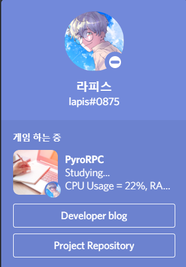

# PyroRPC
PyroRPC is a Discord's Rich Presence client built with Python.

## Features
### 1. Discord Rich Presence
PyroRPC is a Discord's Rich Presence client. 
You can apply custom rich presences on your discord profile.


### 2. GUI based application (WIP)
~~PyroRPC is GUI-based application, so users can easily interact with it.~~
PyroRPC is not maintained (for now), so no GUI features are scheduled in few years. But, I'm still planning it for someday.

### 3. Script features (Beta)
PyroRPC supports scripting with Python, which help users to implement fully customized features on there Rich Presense!

```python
from src.script_support import Script, ScriptEngine

@ScriptEngine.register
class Test(Script):
    def onLoad(self) -> None:
        print('Script is loaded :)')

    def onUnload(self) -> None:
        print('Script is unloaded :(')
```

## How to use?
Currently, PyroRPC is under construction ⚠
But, you can run `app.py` using python 3.8 or upper.

```shell
python app.py
```

### config.json
In `config.json`, you can change configurations of PyroRPC.
```json5
{
  "version": "2021.02",   // config.json template version
  "client_id": "678511156788330509",  // client id of Discord Application
  "profiles": "profiles.json"   // path to profiles.json
}
```
### `client_id`
PyroRPC use default discord application to display rich presence.
However, you can make your own and use it instead of default.
By changing `client_id` value from default to your own discord application's id, you can use your application as rich presence.

### `profiles`
PyroRPC use `Profile` objects to store and load rich presence data.
`profiles.json` contains Profile objects,
and `profiles` key contains a relative path to `profiles.json`

### profiles.json
PyroRPC use 'Profile' objects to store and load rich presence data.
These profiles are stored in `profiles.json`
```json5
{
  "format": "2021.02.dev",  // profiles.json template version
  "data": [                 // array of Profile objects
    {
      "enabled": true,
      "details": "CPU Usage = {cpu}%, RAM Usage = {ram}%",
      "state": "Studying...",
      "large_image": "client.study",
      "large_text": "Studying!",
      "small_image": "client.profile",
      "small_text": "Made by Lapis0875",
      "buttons": [
        {
          "label": "Developer blog",
          "url": "https://lapis0875.github.io",
          "script": "sample.ButtonTest"
        },
        {
          "label": "Project Repository",
          "url": "https://github.com/Lapis0875/DiscordRPCClient",
          "script": "sample.ButtonTest"
        }
      ],
      "script": "sample.HWStatus"
    }
  ]
}
```
`profiles.json` stores Profile objects in `data` array.
You can write your own profiles in here.

### `enabled` (boolean)
`enabled` option indicates whether this profile is enabled or not.
If the profile is disabled, PyroRPC will load it into Profile object, but not use it as rich presence.

### `details` (string)
`details` option contains rich presence details (what the player is currently doing).
[reference](https://discord.com/developers/docs/rich-presence/how-to#updating-presence-update-presence-payload-fields)

### `state` (string)
`state` option contains rich presence state (the user's current party status).
[reference](https://discord.com/developers/docs/rich-presence/how-to#updating-presence-update-presence-payload-fields)

### `large_image` (string)
`large_image` option contains rich presence largeImageKey (name of the uploaded image for the large profile artwork). 
[reference](https://discord.com/developers/docs/rich-presence/how-to#updating-presence-update-presence-payload-fields)

### `large_text` (string)
`large_text` option contains rich presence largeImageText (tooltip for the largeImageKey).
[reference](https://discord.com/developers/docs/rich-presence/how-to#updating-presence-update-presence-payload-fields)

### `small_image` (string)
`small_image` option contains rich presence smallImageKey (name of the uploaded image for the small profile artwork).
[reference](https://discord.com/developers/docs/rich-presence/how-to#updating-presence-update-presence-payload-fields)

### `small_text` (string)
`small_text` option contains rich presence largeImageText (tooltip for the smallImageKey).
[reference](https://discord.com/developers/docs/rich-presence/how-to#updating-presence-update-presence-payload-fields)

### `buttons` (array)
`buttons` contains an array of button objects.
```json5
// button object
{
  "label": "Project Repository",    // text displayed on button.
  "url": "https://github.com/Lapis0875/DiscordRPCClient",   // url to open when user clicked button.
  "script": "sample.ButtonTest"   // script object linked to this object.
}
```
- `label` : Text to display on this button.
- `url` : Url to open by clicking this button.
- `script` : [Script](#scripting) object linked to this button. 
  You can use `null` to indicate that no scripts are linked.

### `script`
`script` contains the name of script.
This option is used for [scripting feature](#scripting).

## Scripting
PyroRPC supports scripting feature.
PyroRPC use [Python](https://www.python.org) as a scripting language.
```python
import psutil
from src.script_support import Script, ScriptEngine

@ScriptEngine.register
class HWStatus(Script):
    def __init__(self, client):
        super().__init__(client)

    def onStart(self) -> None:
        print('Hello world from Script[HWStatus]!')
        print(self.client)

    def onClose(self) -> None:
        pass

    def onLoad(self, profile) -> None:
        cpu = round(psutil.cpu_percent())
        ram = round(psutil.virtual_memory().percent, 1)
        profile.state = profile.state.format(cpu=cpu, ram=ram)

    def onUnload(self, profile) -> None:
        pass

    def onUpdate(self, profile) -> None:
        pass
```
All scripts must subclass `Script` class defined in `src.script_support`.
Currently, scripts can hook those events:
> ScriptEvent
- OnStart   : An event which is called 
- OnClose
- OnLoad
- OnUnload
- OnReload
- OnUpdate
- OnClick
